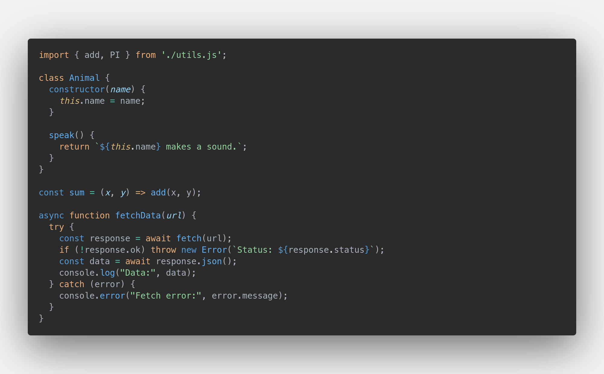

# uckingNice

A cozy, dark Visual Studio Code theme that brings warmth to your coding
sessions. With smooth orange highlights against a deep dark background,
complemented by subtle blue accents, _uckingNice_ creates a comfortable
environment that's easy on the eyes during long coding sessions. The carefully
balanced color palette enhances readability while adding a touch of elegance to
your development workflow.

[GitHub Repo](https://github.com/btschwertfeger/uckingNice)

## Preview


## Review and Feedback

If you enjoy using _uckingNice_ theme, please consider leaving a review. Your
feedback helps improve the theme and makes it more discoverable for other
developers.

If you have suggestions for improvements or encounter any issues, please [open
an issue](https://github.com/btschwertfeger/uckingNice/issues) on GitHub. Your
input is valuable in making this theme even better!

## Good matches

This Theme works best with:

- **Font**: [MesloLGS NF](https://github.com/romkatv/powerlevel10k-media/tree/master)
- **Icons**: Seti (Visual Studio Code; vs-seti) (builtin)

I also like the following settings in `settings.json`:

> Sorry but those must be added manually and can't be packed into a theme.

```json
{
    "breadcrumbs.enabled": true,
    "workbench.activityBar.location": "top",
    "workbench.sideBar.location": "right",
    "editor.fontFamily": "'MesloLGS NF'",
    "editor.cursorSmoothCaretAnimation": "on",
    "editor.inlayHints.enabled": "on",
    "editor.accessibilitySupport": "off",
    "editor.renderWhitespace": "none",
    "editor.renderControlCharacters": true,
    "editor.linkedEditing": true,
    "editor.minimap.enabled": true,
    "explorer.autoReveal": true,
    "terminal.integrated.fontFamily": "'MesloLGS NF'",
    "terminal.integrated.cursorStyle": "line",
    "terminal.integrated.customGlyphs": false,
    "terminal.integrated.cursorBlinking": true,
    "files.trimTrailingWhitespace": true,
}
```

## Markdown Preview


## Python Preview


## JavaScript Preview



## License

This theme is available under the [MIT License](LICENSE).
